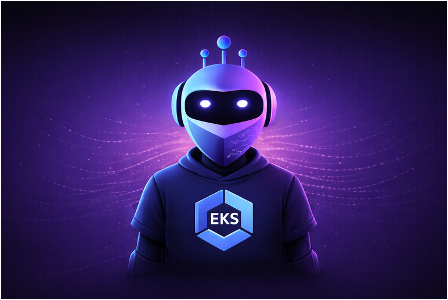

{ .eksr-logo }

# eksreview { .eksr-title }

An AI-powered conversational CLI agent that reviews your Amazon EKS clusters against operational best practices in minutes.
{ .eksr-tagline }

[:material-rocket-launch: Get started](getting-started/installation.md){ .md-button .md-button--primary }
[:material-github: View on GitHub](https://github.com/aws-samples/sample-eksreview){ .md-button }

Using natural language, eksreview runs best-practice checks across six domains (security, resiliency, networking, Karpenter, Cluster Autoscaler, and observability) and produces a prioritized report with ready-to-run remediation for every finding. It also assesses upgrade readiness: weigh your cluster against a target Kubernetes version and it returns a clear go or no-go recommendation with a detailed upgrade plan. From there the conversation keeps going. Ask it to investigate a finding and it goes a level deeper than the report, running live, read-only diagnostics against the cluster to confirm how critical the risk really is and how far it reaches. When you decide to act, it walks you through each remediation one step at a time, and it can export the findings to a JIRA-ready CSV for your backlog.

Its answers are grounded in a local knowledge base (the official EKS Best Practices Guide, plus any runbooks or docs you index), so guidance is cited rather than guessed. Behind the scenes, skills give the agent structured playbooks for reviewing, investigating, and compiling reports, so its output stays consistent run to run. You can add your own custom skills as well, teaching it playbooks tuned to how your team operates. Everything runs locally and read-only by default.

- :material-map-marker-path: **[Your first review](getting-started/first-review.md)**

    Walk through running a review and reading the report.

- :material-checkbox-marked-circle-outline: **[What gets checked](reference/what-gets-checked.md)**

    See the domains and best practices a review covers.

- :material-console: **[Usage](usage/example-prompts.md)**

    Talk to the agent, run reviews, fix findings, export results.

- :material-shield-key: **[Permissions](reference/permissions.md)**

    The read-only IAM policy and cluster access setup.

---

## Why eksreview

AWS publishes and maintains the [EKS Best Practices Guide](https://docs.aws.amazon.com/eks/latest/best-practices/introduction.html) covering security, reliability, scalability, networking, and cost. The guidance is thorough, but working out whether you actually follow it, and which parts even apply to your cluster, is the hard part. You have to read through the recommendations, identify the ones that are relevant to you, then dig through the AWS console and `kubectl` to check whether your setup follows them. That takes deep AWS and Kubernetes expertise and hours of manual effort per cluster, and the results vary depending on who reviews the cluster.

eksreview does that work for you. You ask in natural language, and it inspects your live cluster against the best practices that matter for it, flags what is wrong with severity and impact, and gives you the exact steps to fix each issue. It also assesses upgrade readiness with a clear go or no-go recommendation before you move to a new Kubernetes version. Run it again later and it tracks what has changed since your last review.

It turns a slow, expertise-heavy review into something you can run in minutes, as often as you like.

---

## How it works

eksreview is a conversational agent built on the [Strands Agents SDK](https://github.com/strands-agents/sdk-python) and Anthropic Claude models on Amazon Bedrock. The checks themselves run through a bundled MCP (Model Context Protocol) server that reads your cluster through the EKS, EC2, IAM, and Kubernetes APIs. You do not install or manage that server yourself; it ships in the `mcp-server/` directory and starts automatically via `uv`.

When you ask for a review, eksreview runs the checks and compiles the report in a separate background pass, then returns a concise summary to the conversation. This keeps the chat fast and responsive even on large clusters, because the raw check data never floods your session. When you want the detail behind a finding, it pulls that from the saved report on demand.

For a high-level picture of how the pieces fit together, where everything runs, and how your cluster stays safe, see the [Architecture](architecture.md) overview.

---

## Features

- **Full cluster review:** best-practice checks across security, resiliency, networking, Karpenter, Cluster Autoscaler, and observability, compiled into one report.
- **Upgrade readiness:** checks covering control plane, addons, deprecated APIs, third-party components, and workload resilience, with a go or no-go verdict and an ordered upgrade plan.
- **Guided remediation (`/fix`):** walks through fixes one at a time, classifies each as patchable, AWS CLI, or manifest change, and confirms before running anything.
- **Root cause analysis (`/investigate`):** correlates findings, runs read-only live diagnostics, and assesses real risk beyond the static report.
- **JIRA export (`/export`):** deterministic CSV ready for bulk import, with no LLM involved.
- **Local knowledge base:** index your own runbooks, design docs, and PDFs, and the agent searches and cites them. The EKS Best Practices Guide is auto-synced on startup.
- **Custom skills (`/skill`):** structured playbooks the agent follows for reviewing, investigating, and compiling reports. Add your own to tailor it to how your team works.
- **Runtime model switching (`/model`):** switch between Claude Opus and Sonnet mid-session.
- **Read-only mode (`--no-shell`):** disable command execution entirely for audit-only use.

Ready to try it? Head to [Installation](getting-started/installation.md).
